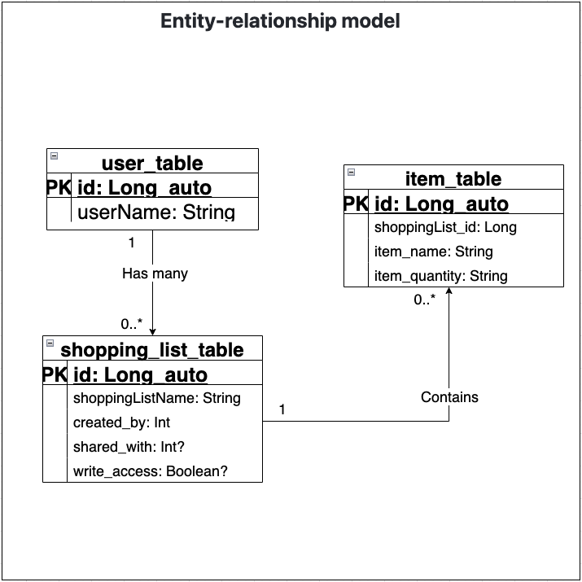

# README #

## **Android RoomDatabase, MVVM - pattern, Compose and dependency injection** ##
***
## *Screenrecord* ##
[ShoppingList-DB.webm](https://user-images.githubusercontent.com/70547966/195814808-91a55057-5089-4911-993a-ebd40ab3baa1.webm)

## *Overview* ##

* Shopping List allow user create several folders, and in each folder the use can create, update and delete items
* The project is build with MVVM architecture pattern
* It used Android roomdatabase to store data, and Compose to build UI

## *Database model, ER diagram* ##
Entities in shopping_list_db
* user_table (<u>id</u>, username)
* shopping_list_table (<u>id</u>, shoppingListName,created_by(FK), shared_with(FK), write_access)
* item_table (<u>id</u>, shoppingList_id(FK), item_name, item_quantity)

The relationship bweteen user_table and sopping_list_tabke is one-to-many. Which means that user can own 0 or as many lists he/she want. The same is for relationship between shopping_list and item_table

